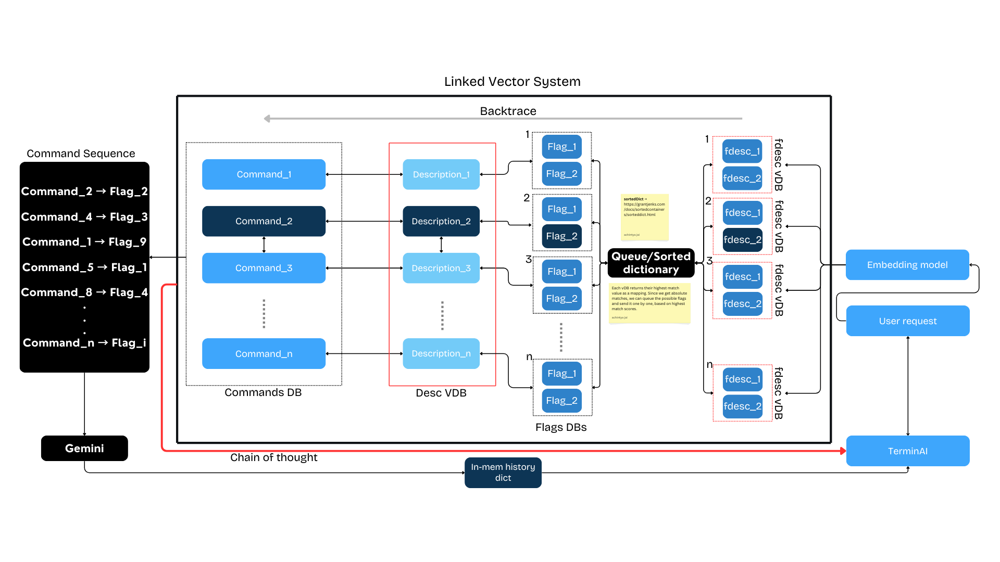
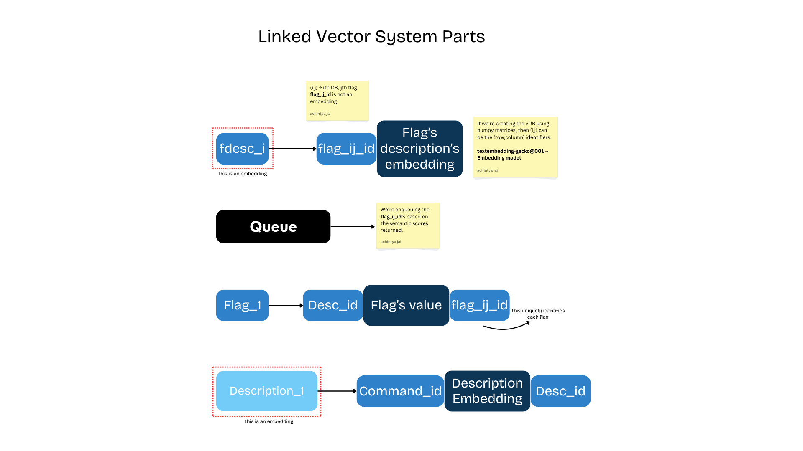

# TerminAI_V3

Refer to [this gcloud setup](./docs/setting_vertexai.md) to ensure you have the right tools to start. 


## Remaining work

- [x] Run .process in a thread so that it doesn't intefere with the GUI.


## Installing and running

This project depends on poetry. To install the necessary dependencies and run TerminAI

		poetry run python3 terminai.py

To add a certain dependency, run

		poetry add <name>

---

## About

A python based terminal with AI capabilities, line of thought and history.

Improvements over version 2:
- [x] Better history management (supabase was overkill and not necessary) we can make do with in-memory history. (comparitively easier)

History is easier if we're using openAI style architecture which luckily GCP and VertexAI support. So, I'll be doing that.

- [x] Use vector embeddings for commands and description and retrieving that then passing to the LLM.

Every command has a `man` page, we can use that to generate a `hybrid vector DB` which means, we're storing the command, its descrption, its flags and their descriptions.

That's a lot of data!

Now based on the user's query, we embed that using Vertex AIs models. 

```

(command )_db -> (descrption)_db; (description)_db -> (description_i)_db -> (flags)_db -> (description)_db

```




The explicit parts of LVS are as shown below:




and finally, the best matches are giving to gemini again (in openAI style to implement history) and the best command is given out.

---

## Creating a vDB

working on that...

---

## Writing tests

- [ ] Setup pytest and unittests
